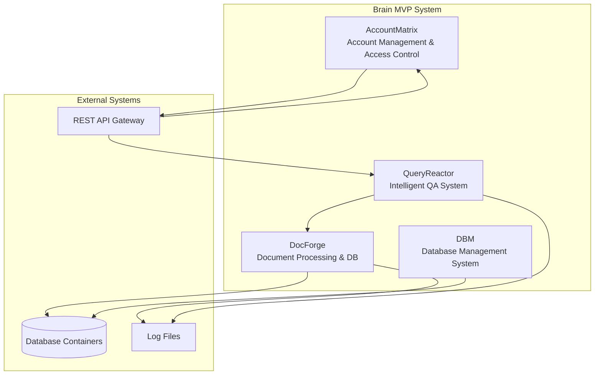
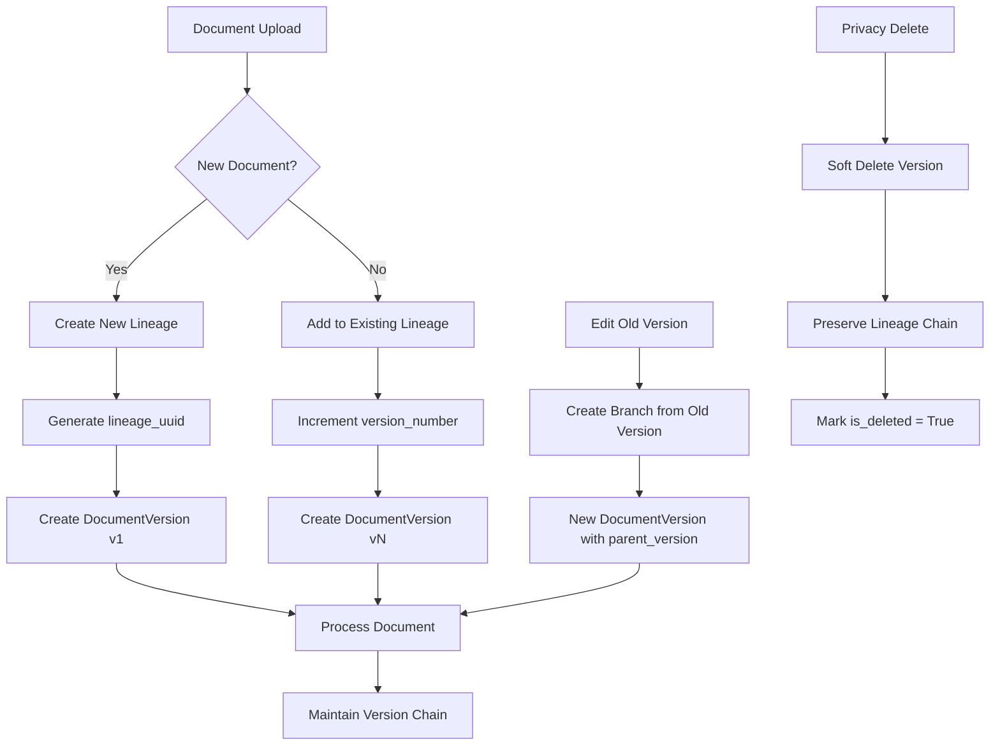
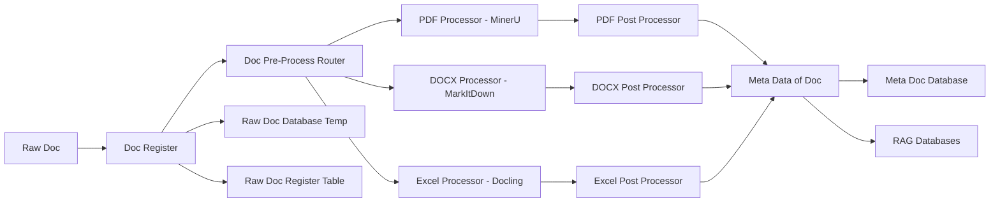

# Design Document - Brain MVP

## Overview

The Brain MVP is an AI-powered development system focused on document processing and intelligent querying. The MVP implementation centers on two core components: **DocForge** (document processing) and **QueryReactor** (intelligent QA system), with simplified dummy implementations for **DBM** (database management) and **AccountMatrix** (access control) to support the core functionality. The system leverages modern Python technologies including LangGraph + PydanticAI for AI orchestration, LightRAG for retrieval-augmented generation, and Docker for containerized deployment.

## MVP Scope

### Core Components (Full Implementation)
- **DocForge**: Complete document processing pipeline
- **QueryReactor**: Full intelligent QA system with AI capabilities

### Supporting Components (Dummy Implementation)
- **DBM**: Basic database operations with minimal functionality
- **AccountMatrix**: Simple authentication with basic user management

## Architecture

The Brain MVP follows a microservices architecture with four main components:



### Component Interactions

- **AccountMatrix** manages authentication and authorization for all system access
- **DocForge** processes documents and maintains document databases
- **QueryReactor** provides intelligent question-answering using processed documents
- **DBM** handles all database operations and maintenance across the system

## Document Versioning and Traceability System

### Versioning Architecture

The Brain MVP implements a comprehensive document versioning system that ensures complete traceability while supporting privacy-focused operations:



### Key Features

1. **Lineage Tracking**: Every document belongs to a lineage chain with complete version history
2. **Version Branching**: Edit old versions to create new branches in the version tree
3. **Soft Deletion**: Privacy-focused deletion that preserves traceability
4. **Content Integrity**: File hashes ensure version integrity and detect changes
5. **Metadata Preservation**: Full metadata history across all versions

### Version Chain Examples

**Linear Versioning**:
```
Lineage: doc-lineage-123
├── v1 (original upload) → doc-uuid-001
├── v2 (updated content) → doc-uuid-002
└── v3 (current) → doc-uuid-003
```

**Branched Versioning** (editing old versions):
```
Lineage: doc-lineage-123
├── v1 (original) → doc-uuid-001
├── v2 → doc-uuid-002
├── v3 → doc-uuid-003
└── v4 (edited from v1) → doc-uuid-004
    └── parent_version: 1
```

**Privacy Deletion**:
```
Lineage: doc-lineage-123
├── v1 (DELETED - privacy) → doc-uuid-001 [is_deleted=True]
├── v2 → doc-uuid-002
└── v3 (current) → doc-uuid-003
```

## Components and Interfaces

### 1. DocForge - Document Processing and Database

**Purpose:** Handles document ingestion, processing, storage, and retrieval operations through a comprehensive pipeline.

**Architecture Flow:**


**Key Components:**

1. **Document Registration Process**
   - Checks if document is new or existing
   - Generates UUID for new documents
   - Records metadata (timestamp, filename, file type, user info)
   - Stores in Raw Document Register Table and Raw Document DB

2. **Document Pre-Processing Router**
   - Examines file metadata
   - Routes to appropriate processor based on file type
   - Supports multiple processor backends

3. **Processors**
   - **PDF Processor**: MinerU (https://github.com/opendatalab/MinerU)
   - **Excel/PowerPoint/Other formats**: MarkItDown (https://github.com/microsoft/markitdown)
   - **Note**: Docling is excluded from MVP scope

4. **Output Format Standardization (CRITICAL)**
   - **Primary Requirement**: Ensure MinerU and MarkItDown outputs are converted to identical format
   - **Standardized Output Schema**: All processors must produce consistent JSON structure
   - **Content Normalization**: Text formatting, metadata structure, and content organization must be uniform
   - **Quality Assurance**: Validation layer to ensure format consistency before downstream processing

5. **Document Post-Processing Router**
   - Determines appropriate post-processing path based on document metadata
   - Queries Post-Process Knowledge Management (KM) DB for decision rules
   - Routes documents to one or multiple downstream processors
   - Supports complex routing logic and conditional processing

6. **Post-Processing Modules**
   - **Document Chunking Strategy**: Analyzes document structure and determines optimal segmentation (paragraph, section, sentence, or topic-based)
   - **Content Enhancement**: 
     - **Abbreviation Expansion**: Automatically identifies and expands abbreviations with full forms
     - **Content Normalization**: Standardizes format and structure
     - **Metadata Enrichment**: Adds contextual information and tags

**Database Structure:**

1. **Document Lineage Table (SQL) - NEW**
   - Tracks document version chains and relationships
   - Maintains complete traceability across all versions
   - Supports privacy-focused deletion while preserving lineage
   - Primary key: lineage_uuid

2. **Raw Document Database**
   - Stores original document files (one file per document version)
   - Binary storage for complete document preservation
   - Indexed by docUUID and lineage_uuid for fast retrieval

3. **Raw Document Register Table (SQL)**
   - Stores document metadata: UUID, file path, file type, timestamp, user info, labels
   - Enhanced with version tracking and lineage relationships
   - Primary key: docUUID
   - Foreign key: lineage_uuid

4. **Raw Document Database (Temp)**
   - Temporary storage for duplicate detection before final upload
   - Supports auto-clean functionality or manual review workflows
   - Prevents duplicate document ingestion

4. **Post-Process Knowledge Management (KM) DB**
   - Stores routing rules used by Document Post-Process Router
   - Contains decision logic for determining processing paths
   - Maintains abbreviation dictionaries and expansion rules
   - Supports dynamic rule updates and versioning

5. **Post Document Database**
   - Stores multiple post-processed versions (sets) of each document
   - Each document can have different processing methods applied
   - Represents various processing approaches for the same source document
   - Enables A/B testing and optimization of processing strategies

6. **Post Document Register Table (SQL)**
   - Stores metadata of post-processed documents
   - Documents share same docUUID but have different setUUIDs
   - Each set contains multiple files with unique fileUUIDs and file paths
   - Tracks processing method, version, and relationships

7. **Meta Document Database**
   - Stores final processed outputs (metadata, images, tables, text)
   - Multiple files per document sharing same docUUID but different metaFileUUIDs
   - Supports complex document structures with multiple components
   - Contains chunked and enhanced content

8. **Meta Document Register Table (SQL)**
   - Stores metadata file paths and associated metadata records
   - Links metaFileUUIDs to docUUIDs
   - Tracks processing status and component relationships
   - Records chunking strategy and post-processing applied

9. **RAG Databases**
   - Optimized vector storage for retrieval operations
   - Prepared from Meta Document Database content
   - Supports semantic search and context retrieval

**Interfaces:**
```python
class DocForgeInterface:
    # Document Registration and Versioning
    def register_document(self, document: RawDocument, parent_lineage: Optional[str] = None, 
                         edit_source_version: Optional[int] = None) -> DocumentRegistration
    def create_document_lineage(self, filename: str, user_id: str) -> str
    def get_document_lineage(self, lineage_uuid: str) -> DocumentLineage
    def get_version_history(self, lineage_uuid: str, include_deleted: bool = False) -> List[DocumentVersion]
    def get_current_version(self, lineage_uuid: str) -> DocumentVersion
    def soft_delete_version(self, doc_uuid: str, reason: str) -> bool
    def soft_delete_lineage(self, lineage_uuid: str, reason: str) -> bool
    def restore_version(self, doc_uuid: str) -> bool
    
    # Processing Pipeline
    def route_document(self, doc_id: str) -> ProcessorType
    def process_document(self, doc_id: str, processor: ProcessorType) -> ProcessingResult
    def route_post_processing(self, processed_doc: ProcessedDocument) -> List[PostProcessorType]
    def determine_chunking_strategy(self, doc_metadata: Dict[str, Any]) -> ChunkingStrategy
    def expand_abbreviations(self, content: str, domain: str) -> str
    def post_process(self, processed_doc: ProcessedDocument) -> MetaDocument
    def prepare_for_rag(self, meta_doc: MetaDocument) -> RAGDocument
    
    # Retrieval and Search
    def retrieve_documents(self, query: Query) -> List[Document]
    def retrieve_document_by_version(self, doc_uuid: str) -> Document
    def retrieve_lineage_documents(self, lineage_uuid: str) -> List[Document]

class PostProcessorType(Enum):
    CHUNKING_STRATEGY = "chunking_strategy"
    ABBREVIATION_EXPANSION = "abbreviation_expansion"
    CONTENT_NORMALIZATION = "content_normalization"
    METADATA_ENRICHMENT = "metadata_enrichment"

class ChunkingStrategy(Enum):
    PARAGRAPH = "paragraph"
    SECTION = "section"
    SENTENCE = "sentence"
    TOPIC = "topic"
    SEMANTIC = "semantic"

class DocumentLineage(BaseModel):
    """Tracks document version chains and relationships"""
    lineage_uuid: str
    original_filename: str
    created_by: str
    created_at: datetime
    current_version: int
    total_versions: int
    is_active: bool  # False if entire lineage is deleted for privacy

class DocumentVersion(BaseModel):
    """Individual document version within a lineage"""
    doc_uuid: str
    lineage_uuid: str
    version_number: int
    parent_version: Optional[int]  # For branching/editing old versions
    filename: str
    file_path: str
    file_type: str
    file_hash: str  # Content hash for integrity
    timestamp: datetime
    user_id: str
    labels: List[str]
    is_current: bool  # Latest version in this branch
    is_deleted: bool  # Soft delete for privacy
    deletion_reason: Optional[str]  # Privacy, user request, etc.
    edit_source_version: Optional[int]  # If this version was created by editing an old version

class DocumentRegistration(BaseModel):
    doc_uuid: str
    lineage_uuid: str
    version_number: int
    filename: str
    file_path: str
    file_type: str
    file_hash: str
    timestamp: datetime
    user_id: str
    labels: List[str]
    is_new_lineage: bool  # True if this is the first version of a new document
    is_duplicate: bool
    parent_version: Optional[int]

class MetaDocument(BaseModel):
    doc_uuid: str
    meta_file_uuid: str
    component_type: str  # e.g., "text", "image", "table", "metadata"
    content: str
    file_path: str
    processing_metadata: Dict[str, Any]
    created_at: datetime

class MetaDocumentRegister(BaseModel):
    meta_file_uuid: str
    doc_uuid: str
    file_path: str
    component_type: str
    metadata_record: Dict[str, Any]
    processing_status: str
    chunking_strategy: ChunkingStrategy
    post_processing_applied: List[PostProcessorType]
    created_at: datetime

class PostProcessRule(BaseModel):
    rule_id: str
    document_type: str
    metadata_conditions: Dict[str, Any]
    processors: List[PostProcessorType]
    priority: int
    is_active: bool

class AbbreviationEntry(BaseModel):
    abbreviation: str
    full_form: str
    domain: str
    confidence_score: float
    usage_context: List[str]

class PostDocument(BaseModel):
    doc_uuid: str
    set_uuid: str
    file_uuid: str
    file_path: str
    processing_method: str
    content: str
    metadata: Dict[str, Any]
    created_at: datetime

class PostDocumentRegister(BaseModel):
    doc_uuid: str
    set_uuid: str
    file_uuid: str
    file_path: str
    processing_method: str
    processing_version: str
    metadata_record: Dict[str, Any]
    created_at: datetime
```

### 2. QueryReactor - Intelligent QA System

**Purpose:** Provides intelligent question-answering capabilities using processed documents and AI models.

**Key Responsibilities:**
- Natural language query processing
- Context retrieval from DocForge
- AI-powered response generation using LangGraph + PydanticAI
- Query history and analytics
- Response quality monitoring

**Interfaces:**
```python
class QueryReactorInterface:
    def process_query(self, query: str, context: QueryContext) -> QueryResponse
    def get_query_history(self, user_id: str) -> List[QueryHistory]
    def analyze_query_patterns(self) -> AnalyticsReport
    def validate_response_quality(self, response: QueryResponse) -> QualityScore
```

### 3. DBM - Database Management System (DUMMY IMPLEMENTATION)

**Purpose:** Provides basic database operations for MVP functionality.

**MVP Scope:** Minimal implementation with basic CRUD operations and simple connection management.

**Key Responsibilities (Simplified):**
- Basic database connection management
- Simple CRUD operations
- Basic error handling

**Interfaces:**
```python
class DBMInterface:
    def create_connection(self, db_config: DatabaseConfig) -> Connection
    def execute_query(self, query: str, params: Dict[str, Any]) -> QueryResult
    def close_connection(self, connection: Connection) -> None
    # Note: Advanced features like migrations, backups, monitoring are NOT implemented in MVP
```

### 4. AccountMatrix - Account Management and Access Control (DUMMY IMPLEMENTATION)

**Purpose:** Provides basic authentication for MVP functionality.

**MVP Scope:** Simple user authentication without complex authorization or security features.

**Key Responsibilities (Simplified):**
- Basic user authentication
- Simple session management
- Minimal user data storage

**Interfaces:**
```python
class AccountMatrixInterface:
    def authenticate_user(self, username: str, password: str) -> bool
    def create_session(self, user_id: str) -> str
    def validate_session(self, session_token: str) -> Optional[str]
    # Note: RBAC, API keys, audit logging, external providers are NOT implemented in MVP
```

## Data Models

### Core Data Models

```python
from pydantic import BaseModel
from typing import List, Optional, Dict, Any
from datetime import datetime
from enum import Enum

class RawDocument(BaseModel):
    content: bytes
    filename: str
    file_type: str
    user_id: str
    upload_timestamp: datetime

class Document(BaseModel):
    id: str
    title: str
    content: str
    metadata: Dict[str, Any]
    created_at: datetime
    updated_at: datetime
    version: int
    embeddings: Optional[List[float]]

class ProcessedDocument(BaseModel):
    doc_uuid: str
    file_uuid: str
    extracted_content: str
    processor_type: str
    processing_metadata: Dict[str, Any]
    processing_timestamp: datetime

class ProcessorType(Enum):
    MINERU_PDF = "mineru_pdf"
    MARKITDOWN = "markitdown"

class StandardizedOutput(BaseModel):
    """Uniform output format for all processors - CRITICAL for system consistency"""
    doc_uuid: str
    content: str
    metadata: Dict[str, Any]
    extracted_elements: List[Dict[str, Any]]  # images, tables, etc.
    processing_info: Dict[str, Any]
    format_version: str = "1.0"

class Query(BaseModel):
    id: str
    text: str
    user_id: str
    timestamp: datetime
    context: Dict[str, Any]

class QueryResponse(BaseModel):
    query_id: str
    response_text: str
    confidence_score: float
    sources: List[str]
    processing_time: float
    timestamp: datetime

class User(BaseModel):
    id: str
    username: str
    email: str
    roles: List[str]
    permissions: List[str]
    created_at: datetime
    last_login: Optional[datetime]

class ProjectPhase(Enum):
    PLANNING = "planning"
    DEVELOPMENT = "development"
    TESTING = "testing"
    DEPLOYMENT = "deployment"

class DevelopmentLog(BaseModel):
    id: str
    phase: ProjectPhase
    activity_type: str
    description: str
    files_affected: List[str]
    timestamp: datetime
    user_id: str
```

## Error Handling

### Error Categories

1. **Authentication Errors** - Handled by AccountMatrix
2. **Document Processing Errors** - Handled by DocForge with retry mechanisms
3. **Query Processing Errors** - Handled by QueryReactor with fallback responses
4. **Database Errors** - Handled by DBM with connection pooling and failover

### Error Response Format

```python
class ErrorResponse(BaseModel):
    error_code: str
    error_message: str
    timestamp: datetime
    request_id: str
    component: str
    details: Optional[Dict[str, Any]]
```

## Testing Strategy

### Unit Testing
- Individual component testing using pytest
- Mock external dependencies (databases, AI models)
- Test data validation and business logic
- Coverage target: 90%+

### Integration Testing
- Component interaction testing
- Database integration testing
- API endpoint testing
- Docker container orchestration testing

### End-to-End Testing
- Full workflow testing (document ingestion → query → response)
- User authentication and authorization flows
- Performance testing under load
- Disaster recovery testing

### AI Model Testing
- Response quality validation
- Prompt engineering effectiveness
- Context retrieval accuracy
- Performance benchmarking

## Technology Stack Integration

### uv Package Management
- Dependency resolution and virtual environment management
- Fast package installation and updates
- Lock file management for reproducible builds

### LangGraph + PydanticAI
- AI workflow orchestration in QueryReactor
- Structured AI interactions with type safety
- Complex reasoning chains and decision trees

### 
- Document embedding and retrieval in DocForge
- Semantic search capabilities
- Context-aware document chunking

### Docker Architecture
```yaml
services:
  brain-api:
    build: ./api
    ports:
      - "8000:8000"
    depends_on:
      - postgres
      - redis
  
  postgres:
    image: postgres:15
    environment:
      POSTGRES_DB: brain_db
    volumes:
      - postgres_data:/var/lib/postgresql/data
  
  redis:
    image: redis:7
    volumes:
      - redis_data:/data
  
  docforge:
    build: ./docforge
    depends_on:
      - postgres
  
  queryreactor:
    build: ./queryreactor
    depends_on:
      - docforge
      - redis
```

## Security Considerations

- JWT-based authentication with refresh tokens
- Role-based access control with fine-grained permissions
- API rate limiting and request validation
- Encrypted data storage and transmission
- Audit logging for all security-relevant events
- Container security scanning and updates

## Scalability and Performance

- Horizontal scaling through container orchestration
- Database connection pooling and read replicas
- Caching layer using Redis for frequent queries
- Asynchronous processing for document ingestion
- Load balancing across multiple API instances

## Monitoring and Observability

- Structured logging with correlation IDs
- Metrics collection for performance monitoring
- Health checks for all components
- Distributed tracing for request flows
- Alerting for system anomalies and errors