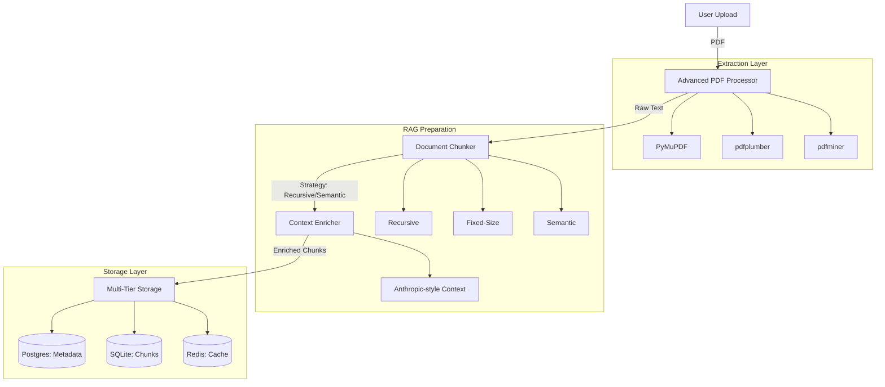

# Brain MVP - Complete Project Explanation

## 🌟 System Overview

The Brain MVP is a high-precision **document processing and knowledge management system**. It transforms raw PDF documents into structured, searchable, and AI-ready data. Unlike simple text extractors, it implements a sophisticated pipeline designed for **Retrieval-Augmented Generation (RAG)**, featuring advanced chunking, context enrichment, and multi-tier storage.

---

## 🔄 End-to-End Pipeline

The following diagram illustrates the complete journey of a document from upload to being "RAG-ready".



### 1. Extraction Phase
The **Advanced PDF Processor** uses a multi-library strategy with automatic fallbacks:
- **PyMuPDF**: Primary engine, extremely fast and accurate.
- **pdfplumber**: Fallback for complex layouts and tables.
- **pdfminer**: Final fallback for difficult or legacy PDFs.

### 2. Chunking Phase
Documents are split into manageable "chunks" using configurable strategies:
- **Recursive**: Respects natural boundaries like paragraphs and sentences.
- **Semantic**: Uses AI embeddings to find logical breaks in meaning.
- **Fixed-Size**: Standard token-based windows with overlap.

### 3. Context Enrichment Phase
To solve the "lost in translation" problem in RAG, each chunk is optionally enriched with document-level context. This provides the LLM with the "big picture" for every small piece of text, significantly improving retrieval accuracy.

---

## 📡 API Usage & Integration

The system provides a comprehensive REST API for both document management and RAG operations.

### Core Endpoints

| Category | Method | Endpoint | Description |
|----------|--------|----------|-------------|
| **Upload** | `POST` | `/api/v1/documents/upload` | Upload PDF and start processing |
| **Status** | `GET` | `/api/v1/documents/{id}/status` | Check extraction/chunking progress |
| **Content** | `GET` | `/api/v1/documents/{id}/content` | Get full text (Text/JSON/Markdown) |
| **Chunks** | `GET` | `/api/v1/chunks/document/{id}` | Get all processed chunks for RAG |
| **Delete** | `DELETE` | `/api/v1/documents/{id}` | Permanent deletion of all data |

### Example: Upload and Retrieve Chunks

```bash
# 1. Upload a document
curl -X POST "http://localhost:8080/api/v1/documents/upload" -F "file=@report.pdf"

# 2. Get the chunks for your RAG application
curl "http://localhost:8080/api/v1/chunks/document/{document_id}"
```

---

## 🗄 Data Architecture

The system uses a specialized multi-database approach to ensure performance and scalability.

### 1. Metadata Storage (PostgreSQL)
Stores the high-level document information, lineage, and processing history.
- **Table**: `raw_document_register` (Original file info)
- **Table**: `document_lineage` (Version tracking)

### 2. Chunk Storage (SQLite/Postgres)
Stores the actual text segments, their embeddings, and enrichment content.
- **Table**: `document_chunks`
  - `original_content`: The raw text segment.
  - `enriched_content`: The text + document context.
  - `chunk_metadata`: Index, strategy, and token counts.

---

## 🐳 Docker & Deployment

The system is fully containerized for "one-command" deployment.

### Services
- **brain-mvp-app**: The FastAPI engine and processing logic.
- **brain-mvp-postgres**: Persistent storage for metadata.
- **brain-mvp-redis**: High-speed cache for background tasks.

### Environment Configuration
Key settings can be adjusted in `docker-compose.yml`:
- `PROCESSING__DEFAULT_CHUNKING_STRATEGY`: Default strategy (recursive/semantic).
- `OPENAI_API_KEY`: Required for semantic chunking and enrichment.

---

## 🛡 Security & Management

- **Individual Deletion**: Users can delete specific documents via the Web UI or API. This triggers a cascading delete across all databases (Metadata, Chunks, and Versions).
- **CORS Enabled**: The API is open for integration with any external frontend or service.
- **Interactive Docs**: Full API documentation is available at `http://localhost:8080/docs`.

**The Brain MVP is designed to be the "intelligent bridge" between your raw documents and your AI applications.**